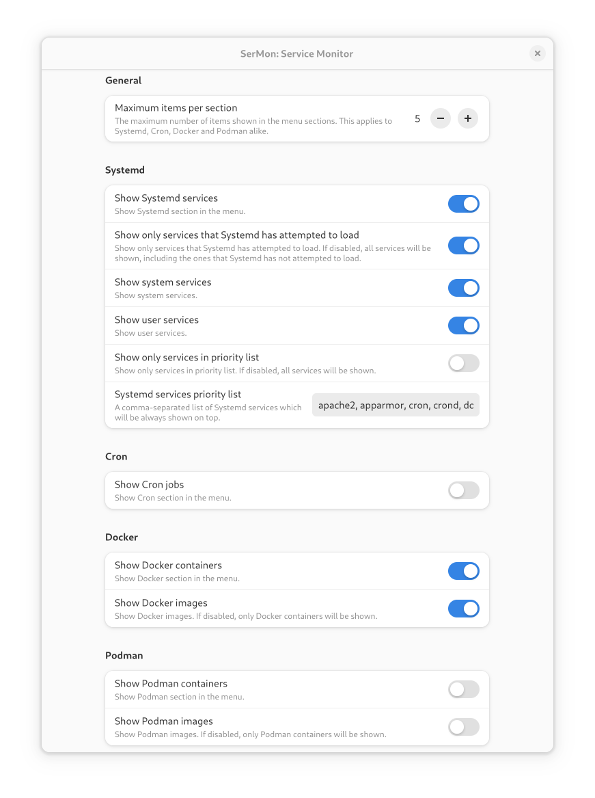

SerMon: Service Monitor
=======================

A GNOME Shell extension for monitoring and managing systemd services, cron jobs, docker and poman containers.

You can configure it to show only the information you are interested in (e.g. only systemd services and/or docker containers).

Published at: https://extensions.gnome.org/extension/1804/sermon/

[](https://github.com/rovellipaolo/gnome-shell-extension-sermon/actions)
[](https://coveralls.io/github/rovellipaolo/gnome-shell-extension-sermon)
[](https://img.shields.io/badge/License-GPL%20v2-blue.svg)

[](https://extensions.gnome.org/extension/1804/sermon/)


## Overview

The `master` branch includes all stable features and currently supports GNOME Shell _45_, _46_ and _47_.
Among others, this version of GNOME Shell is used in the following Linux distributions:
* Fedora 39, 40 and 41
* Ubuntu 23.10 (Mantic Minotaur), 24.04 LTS (Noble Numbat) and 24.10 (Oracular Oriole)

The `gnome-shell-42-0` branch is a discontinued backport to GNOME Shell _3.34_, _3.36_, _3.38_, _40_, _41_, _42_, _43_ and _44_.
Among others, these versions of GNOME Shell are used in the following Linux distributions:
* Debian 11 (Bullseye) and 12 (Bookworm)
* Fedora 31, 32, 33, 34, 35, 36, 37 and 38
* Mageia 8 and 9
* Manjaro 19.0, 20.x, 21.x and 22.0 to 22.1
* openSUSE Leap 15.2, 15.3, 15.4 and 15.5
* Red Hat Enterprise Linux 9.0 to 9.5 (Plow)
* SUSE Linux Enterprise Desktop 15 SP2, SP3, SP4 and SP5
* Ubuntu 19.10 (Eoan Ermine), 20.04 LTS (Focal Fossa), 20.10 (Groovy Gorilla), 21.04 (Hirsute Hippo), 21.10 (Impish Indri), 22.04 LTS (Jammy Jellyfish), 22.10 (Kinetic Kudu) and 23.04 (Lunar Lobster)

The `gnome-shell-3-32` branch is a discontinued backport to GNOME Shell _3.32_.
Among others, this version of GNOME Shell is used in the following Linux distributions:
* Fedora 30
* Mageia 7 and 7.1
* Red Hat Enterprise Linux 8.1 to 8.10 (Ootpa)
* Ubuntu 19.04 (Disco Dingo)

The `gnome-shell-3-28` branch is a discontinued backport to GNOME Shell _3.26_, _3.28_ and _3.30_.
Among others, these versions of GNOME Shell are used in the following Linux distributions:
* Debian 10 (Buster)
* Fedora 27, 28 and 29
* openSUSE Leap 15.0 and 15.1
* Red Hat Enterprise Linux 7.5 to 7.9 (Maipo) and 8.0 (Ootpa)
* SUSE Linux Enterprise Desktop 15 and 15 SP1
* Ubuntu 18.04 LTS (Bionic Beaver) and 18.10 (Cosmic Cuttlefish)


## Build

To clone the repository execute:
```shell
$ git clone https://github.com/rovellipaolo/gnome-shell-extension-sermon
$ cd gnome-shell-extension-sermon
```

To build the extension execute:
```shell
$ make build
```
**NOTE:** This will create a zip archive named `sermon@rovellipaolo-gmail.com.shell-extension.zip`.

To install the extension execute:
```shell
$ make install
```
**NOTE:** This will unzip the previously builded zip archive into `~/.local/share/gnome-shell/extensions/sermon@rovellipaolo-gmail.com`.

Afterwards, restart GNOME Shell: press `Alt`+`F2`, type `r` and press enter.

Finally, if not already done, enable the extension at: [https://extensions.gnome.org](https://extensions.gnome.org/local)
Or, alternatively, to enable the extension execute:
```shell
$ make enable
```
While to disable the extension execute:
```shell
$ make disable
```

## Configure

See existing settings at: https://extensions.gnome.org/local/



To change the settings go to: `org.gnome.shell.extensions.sermon.gschema.xml`
And then execute:
```shell
$ make build-settings
```

## Test

To run the tests and checkstyle execute:
```shell
$ make test
$ make checkstyle
```

You can also run the tests with coverage by launching the following command:
```shell
$ make test-coverage
```

And/or configure the checkstyle to run automatically at every git commit by launching the following command:
```shell
$ make install-githooks
```


## Operate

To show GNOME Shell logs execute:
```shell
$ make show-logs
```


## Licence

SerMon is licensed under the GNU General Public License v2.0 (http://www.gnu.org/licenses/gpl-2.0.html).
